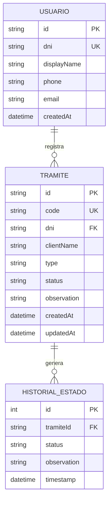
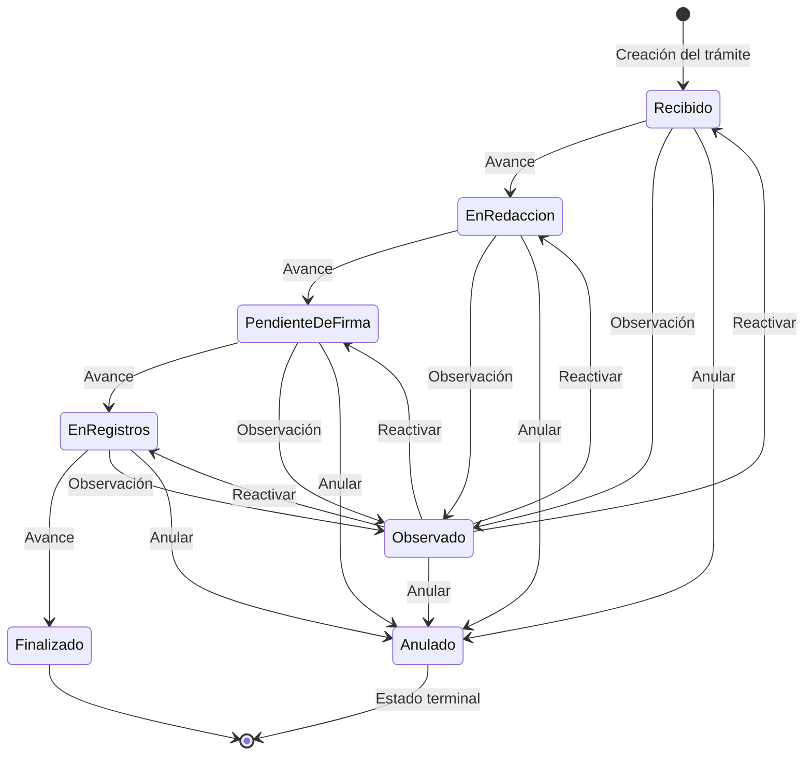
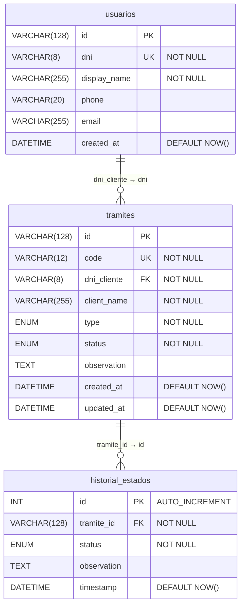
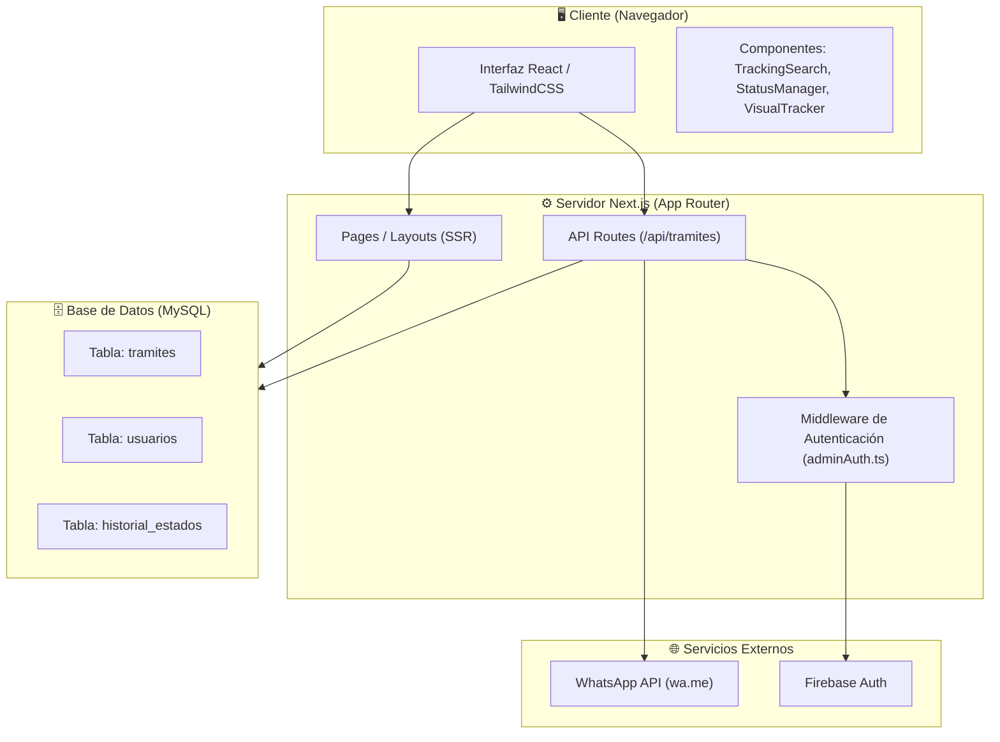

# Documentación Técnica – PainoTrack

---

## 3.2 MODELO CONCEPTUAL O LÓGICO DE ENTIDADES

El sistema **PainoTrack** gestiona dos entidades principales que se relacionan entre sí: el **Usuario** (cliente de la notaría) y el **Trámite** notarial. La entidad de historial actúa como una entidad débil dependiente del trámite.

### Diagrama Entidad-Relación (Conceptual)



### Descripción de Entidades

| Entidad | Descripción |
|---|---|
| **USUARIO** | Representa al cliente de la notaría. Almacena datos personales y de contacto. Se identifica de forma única por su DNI. |
| **TRAMITE** | Representa un procedimiento notarial iniciado por un usuario. Contiene el tipo de acto, el estado actual y observaciones. |
| **HISTORIAL_ESTADO** | Registra cada cambio de estado del trámite, permitiendo trazabilidad completa del flujo de trabajo. |

### Estados del Trámite (Máquina de Estados)



---

## 3.3 MODELO FÍSICO RELACIONAL DE BASE DE DATOS

El modelo físico traduce el diseño conceptual en tablas relacionales normalizadas hasta la **Tercera Forma Normal (3FN)**, listas para ser implementadas en **MySQL 8.x**.

### Diagrama Relacional (Físico)



### Descripción de Campos clave

**Tabla `tramites`**

| Campo | Tipo | Descripción |
|---|---|---|
| `id` | VARCHAR(128) | Identificador único generado por el sistema |
| `code` | VARCHAR(12) | Código legible generado (`PN-XXXXXX`) |
| `dni_cliente` | VARCHAR(8) | DNI del cliente (FK hacia `usuarios.dni`) |
| `client_name` | VARCHAR(255) | Nombre del cliente al momento del registro |
| `type` | ENUM | Tipo de acto notarial |
| `status` | ENUM | Estado actual del trámite |
| `observation` | TEXT | Motivo de observación o anulación |
| `created_at` | DATETIME | Fecha de creación |
| `updated_at` | DATETIME | Fecha de última actualización |

**Tabla `historial_estados`**

| Campo | Tipo | Descripción |
|---|---|---|
| `id` | INT | Clave primaria autoincremental |
| `tramite_id` | VARCHAR(128) | FK al trámite al que pertenece |
| `status` | ENUM | Estado registrado en este punto |
| `observation` | TEXT | Observación asociada al cambio |
| `timestamp` | DATETIME | Momento exacto del cambio de estado |

---

## 3.4 ARQUITECTURA DEL DESARROLLO DE LA PROPUESTA

PainoTrack sigue una arquitectura **cliente-servidor moderna** basada en el patrón **JAMstack** con renderizado híbrido (SSR + CSR) provisto por **Next.js**.

### Diagrama de Arquitectura General



### Capas de la Arquitectura

| Capa | Tecnología | Responsabilidad |
|---|---|---|
| **Presentación** | React 19 + TailwindCSS 4 | Renderizado de UI, formularios, componentes |
| **Enrutamiento** | Next.js 16 App Router | Rutas de página y API, SSR/CSR híbrido |
| **Lógica de Negocio** | TypeScript + API Routes | Validación, cambios de estado, generación de código |
| **Acceso a Datos** | MySQL 8 + ORM (Prisma/mysql2) | Consultas, transacciones, persistencia |
| **Autenticación** | Firebase Authentication | Gestión de sesiones del panel administrativo |
| **Notificaciones** | WhatsApp Web API | Alertas automáticas al cliente al cambiar estado |

---

## 3.5 SCRIPT DE BASE DE DATOS

Script SQL completo para **MySQL 8.x** que crea la base de datos, tablas, índices, y relaciones con integridad referencial.

```sql
-- ============================================================
-- PainoTrack Database Schema
-- Motor: MySQL 8.x
-- Charset: utf8mb4 | Collation: utf8mb4_unicode_ci
-- ============================================================

CREATE DATABASE IF NOT EXISTS painotrack
    CHARACTER SET utf8mb4
    COLLATE utf8mb4_unicode_ci;

USE painotrack;

-- ------------------------------------------------------------
-- Tabla: usuarios
-- Almacena los clientes de la notaría.
-- ------------------------------------------------------------
CREATE TABLE IF NOT EXISTS usuarios (
    id           VARCHAR(128)  NOT NULL,
    dni          VARCHAR(8)    NOT NULL,
    display_name VARCHAR(255)  NOT NULL,
    phone        VARCHAR(20)   DEFAULT NULL,
    email        VARCHAR(255)  DEFAULT NULL,
    created_at   DATETIME      NOT NULL DEFAULT CURRENT_TIMESTAMP,

    CONSTRAINT pk_usuarios PRIMARY KEY (id),
    CONSTRAINT uq_usuarios_dni UNIQUE (dni)
) ENGINE=InnoDB DEFAULT CHARSET=utf8mb4 COLLATE=utf8mb4_unicode_ci;

-- ------------------------------------------------------------
-- Tabla: tramites
-- Almacena los trámites notariales y su estado actual.
-- ------------------------------------------------------------
CREATE TABLE IF NOT EXISTS tramites (
    id          VARCHAR(128)  NOT NULL,
    code        VARCHAR(12)   NOT NULL,
    dni_cliente VARCHAR(8)    NOT NULL,
    client_name VARCHAR(255)  NOT NULL,
    type        ENUM(
                    'Escritura',
                    'Poder',
                    'Vehicular',
                    'Constitución'
                )             NOT NULL DEFAULT 'Escritura',
    status      ENUM(
                    'Recibido',
                    'En Redacción',
                    'Pendiente de Firma',
                    'En Registros',
                    'Finalizado',
                    'Observado',
                    'Anulado'
                )             NOT NULL DEFAULT 'Recibido',
    observation TEXT          DEFAULT NULL,
    created_at  DATETIME      NOT NULL DEFAULT CURRENT_TIMESTAMP,
    updated_at  DATETIME      NOT NULL DEFAULT CURRENT_TIMESTAMP ON UPDATE CURRENT_TIMESTAMP,

    CONSTRAINT pk_tramites PRIMARY KEY (id),
    CONSTRAINT uq_tramites_code UNIQUE (code),
    CONSTRAINT fk_tramites_usuario
        FOREIGN KEY (dni_cliente)
        REFERENCES usuarios(dni)
        ON UPDATE CASCADE
        ON DELETE RESTRICT
) ENGINE=InnoDB DEFAULT CHARSET=utf8mb4 COLLATE=utf8mb4_unicode_ci;

-- Índice para búsquedas por DNI y por código
CREATE INDEX idx_tramites_dni  ON tramites(dni_cliente);
CREATE INDEX idx_tramites_code ON tramites(code);

-- ------------------------------------------------------------
-- Tabla: historial_estados
-- Registra cada cambio de estado de un trámite.
-- ------------------------------------------------------------
CREATE TABLE IF NOT EXISTS historial_estados (
    id          INT           NOT NULL AUTO_INCREMENT,
    tramite_id  VARCHAR(128)  NOT NULL,
    status      ENUM(
                    'Recibido',
                    'En Redacción',
                    'Pendiente de Firma',
                    'En Registros',
                    'Finalizado',
                    'Observado',
                    'Anulado'
                )             NOT NULL,
    observation TEXT          DEFAULT NULL,
    timestamp   DATETIME      NOT NULL DEFAULT CURRENT_TIMESTAMP,

    CONSTRAINT pk_historial PRIMARY KEY (id),
    CONSTRAINT fk_historial_tramite
        FOREIGN KEY (tramite_id)
        REFERENCES tramites(id)
        ON UPDATE CASCADE
        ON DELETE CASCADE
) ENGINE=InnoDB DEFAULT CHARSET=utf8mb4 COLLATE=utf8mb4_unicode_ci;

-- Índice para recuperar historial de un trámite eficientemente
CREATE INDEX idx_historial_tramite_id ON historial_estados(tramite_id);

-- ============================================================
-- STORED PROCEDURE: actualizar_estado_tramite
-- Actualiza el estado y registra en el historial atómicamente.
-- ============================================================
DELIMITER //

CREATE PROCEDURE actualizar_estado_tramite(
    IN  p_tramite_id  VARCHAR(128),
    IN  p_status      VARCHAR(50),
    IN  p_observation TEXT
)
BEGIN
    DECLARE EXIT HANDLER FOR SQLEXCEPTION
    BEGIN
        ROLLBACK;
        RESIGNAL;
    END;

    START TRANSACTION;

    UPDATE tramites
       SET status      = p_status,
           observation = p_observation,
           updated_at  = CURRENT_TIMESTAMP
     WHERE id = p_tramite_id;

    INSERT INTO historial_estados (tramite_id, status, observation, timestamp)
    VALUES (p_tramite_id, p_status, p_observation, CURRENT_TIMESTAMP);

    COMMIT;
END //

DELIMITER ;

-- ============================================================
-- Datos de ejemplo (seed)
-- ============================================================
INSERT INTO usuarios (id, dni, display_name, phone, email) VALUES
    ('usr_001', '12345678', 'Juan Pérez',    '51987654321', 'juan.perez@email.com'),
    ('usr_002', '87654321', 'María García',  '51912345678', 'maria.garcia@email.com');

INSERT INTO tramites (id, code, dni_cliente, client_name, type, status) VALUES
    ('trm_001', 'PN-100001', '12345678', 'Juan Pérez',   'Escritura',     'En Redacción'),
    ('trm_002', 'PN-100002', '87654321', 'María García', 'Constitución',  'Recibido');

INSERT INTO historial_estados (tramite_id, status, observation) VALUES
    ('trm_001', 'Recibido',      NULL),
    ('trm_001', 'En Redacción',  NULL),
    ('trm_002', 'Recibido',      NULL);
```

---

## 3.5 DESCRIPCIÓN DE LENGUAJE DE PROGRAMACIÓN

PainoTrack está desarrollado con un stack moderno de **JavaScript/TypeScript** fullstack.

### Stack Tecnológico Principal

| Tecnología | Versión | Rol |
|---|---|---|
| **TypeScript** | 5.x | Lenguaje principal (tipado estático sobre JS) |
| **Next.js** | 16.1.6 | Framework fullstack (SSR, App Router, API Routes) |
| **React** | 19.x | Librería de UI basada en componentes |
| **TailwindCSS** | 4.x | Framework de estilos utilitario (CSS-in-class) |
| **MySQL** | 8.x | Sistema de gestión de base de datos relacional |
| **Firebase Auth** | 12.x | Autenticación del panel administrativo |
| **Framer Motion** | 12.x | Animaciones declarativas en React |
| **Lucide React** | 0.563 | Iconografía SVG optimizada para React |

### TypeScript como Lenguaje Base

**TypeScript** es un superconjunto tipado de JavaScript desarrollado por Microsoft. Permite:

- **Tipado estático**: Detecta errores en tiempo de compilación en lugar de ejecución.
- **Interfaces y tipos**: Define contratos claros entre componentes y servicios.
- **IntelliSense avanzado**: Mejora la productividad con autocompletado y refactoring seguro.

En PainoTrack, TypeScript se utiliza para definir los contratos de entidades (`Tramite`, `TramiteStatus`), garantizando coherencia entre el frontend y el backend.

### Next.js como Framework Fullstack

**Next.js** provee capacidades de renderizado híbrido:

- **Server-Side Rendering (SSR)**: El panel de administración carga los trámites ya renderizados desde el servidor.
- **Client-Side Rendering (CSR)**: Los modales de gestión (`StatusManager`) interactúan dinámicamente sin recargar la página.
- **API Routes**: El directorio `/api/tramites` expone endpoints REST directamente en el mismo proyecto.

---

## 3.6 FUENTE O CÓDIGO DE INSTRUCCIONES

A continuación se presentan los fragmentos de código más representativos de la lógica de negocio del sistema.

### Definición de Entidades y Tipos (`db.ts`)

Define el contrato de la entidad `Tramite` y los estados posibles del flujo de trabajo:

```typescript
// src/lib/db.ts

export type TramiteStatus =
  | 'Recibido'
  | 'En Redacción'
  | 'Pendiente de Firma'
  | 'En Registros'
  | 'Finalizado'
  | 'Observado'
  | 'Anulado';

export interface Tramite {
  id: string;
  code?: string;
  dni: string;
  clientName: string;
  type: string;
  status: TramiteStatus;
  observation?: string;
  createdAt: string;
  updatedAt: string;
  history: {
    status: TramiteStatus;
    timestamp: string;
    observation?: string;
  }[];
}
```

### Creación de Trámite con Código Único (`TramiteService.create`)

Genera un código único `PN-XXXXXX` y persiste el trámite con su estado inicial en el historial:

```typescript
async create(
  data: Omit<Tramite, 'id' | 'createdAt' | 'updatedAt' | 'history' | 'code'>
): Promise<Tramite> {
  // Generación del código legible único
  const code = `PN-${Math.floor(100000 + Math.random() * 900000)}`;

  const newTramite = {
    ...data,
    code,
    createdAt: new Date(),
    updatedAt: new Date(),
    // Se registra el primer estado en el historial automáticamente
    history: [{ status: data.status, timestamp: new Date() }]
  };

  // Equivalente SQL:
  // INSERT INTO tramites (id, code, dni_cliente, client_name, type, status, ...)
  // VALUES (uuid(), 'PN-100001', '12345678', 'Juan Pérez', 'Escritura', 'Recibido', ...);
  const docRef = await addDoc(collection(db, 'tramites'), newTramite);

  return { id: docRef.id, ...newTramite } as Tramite;
}
```

### Actualización de Estado con Historial (`TramiteService.updateStatus`)

Actualiza el estado y agrega un registro al historial de forma atómica:

```typescript
async updateStatus(
  id: string,
  status: TramiteStatus,
  observation?: string
): Promise<void> {
  const docRef = doc(db, 'tramites', id);
  const docSnap = await getDoc(docRef);
  if (!docSnap.exists()) throw new Error('Tramite not found');

  const currentHistory = docSnap.data().history || [];

  const updateData: any = {
    status,
    updatedAt: new Date(),
    // Se agrega el nuevo cambio al historial existente
    history: [...currentHistory, {
      status,
      timestamp: new Date(),
      ...(observation ? { observation } : {})
    }]
  };

  // Limpieza de observación cuando el estado es normal
  if (observation !== undefined) {
    updateData.observation = observation;
  } else if (status !== 'Observado' && status !== 'Anulado') {
    updateData.observation = null;
  }

  // Equivalente SQL (via stored procedure):
  // CALL actualizar_estado_tramite('trm_001', 'En Redacción', NULL);
  await updateDoc(docRef, updateData);
}
```

### Flujo de Control de Estados (`StatusManager.tsx`)

Define el flujo lineal de estados y calcula el siguiente estado disponible:

```typescript
// Flujo principal de estados (secuencial)
const STATUS_FLOW: TramiteStatus[] = [
  'Recibido',
  'En Redacción',
  'Pendiente de Firma',
  'En Registros',
  'Finalizado'
];

// Calcula el siguiente estado en el flujo
const getNextStatus = (): TramiteStatus | null => {
  const currentIndex = STATUS_FLOW.indexOf(tramite.status);
  if (currentIndex >= 0 && currentIndex < STATUS_FLOW.length - 1) {
    return STATUS_FLOW[currentIndex + 1];
  }
  return null; // Trámite ya está en estado final
};

// Previene modificar trámites anulados (estado terminal)
const openModal = () => {
  if (tramite.status === 'Anulado') {
    alert('Este trámite está anulado y no se puede modificar.');
    return;
  }
  setIsOpen(true);
};
```

### Búsqueda de Trámite por DNI o Código (`TramiteService.getByCodeOrDni`)

Permite al cliente público consultar su trámite con ambos criterios:

```typescript
async getByCodeOrDni(search: string): Promise<Tramite | null> {
  // Búsqueda primaria por DNI
  // SQL: SELECT * FROM tramites WHERE dni_cliente = '12345678' LIMIT 1;
  let q = query(tramitesRef, where('dni', '==', search));
  let querySnapshot = await getDocs(q);

  // Si no se encontró por DNI, busca por código
  if (querySnapshot.empty) {
    // SQL: SELECT * FROM tramites WHERE code = 'PN-100001' LIMIT 1;
    q = query(tramitesRef, where('code', '==', search));
    querySnapshot = await getDocs(q);
  }

  if (querySnapshot.empty) return null;

  const doc = querySnapshot.docs[0];
  return {
    id: doc.id,
    ...doc.data(),
    createdAt: formatDate(doc.data().createdAt),
    updatedAt: formatDate(doc.data().updatedAt),
    history: (doc.data().history || []).map((h: any) => ({
      ...h,
      timestamp: formatDate(h.timestamp)
    }))
  } as Tramite;
}
```

### Notificación WhatsApp al Cambiar Estado

Genera automáticamente un enlace de WhatsApp con el mensaje de cambio de estado:

```typescript
// Dentro de handleUpdate() en StatusManager.tsx
if (data.clientData && data.clientData.phone) {
  const { name, phone, code, type } = data.clientData;

  // Limpia el número de teléfono (solo dígitos)
  const cleanPhone = phone.replace(/\D/g, '');

  const message =
    `Hola ${name || 'Cliente'}, le saluda Lucía de Notaría Paino. ` +
    `Le informo que su trámite ${code || ''} (${type || ''}) ` +
    `ha cambiado al estado: ${selectedStatus}.` +
    `${observation ? ` Observación: ${observation}` : ''}`;

  // Abre WhatsApp Web con el mensaje precompuesto
  const whatsappUrl =
    `https://wa.me/${cleanPhone}?text=${encodeURIComponent(message)}`;
  window.open(whatsappUrl, '_blank');
}
```
